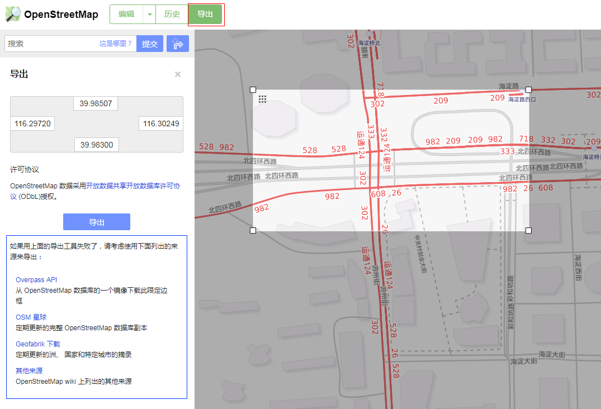
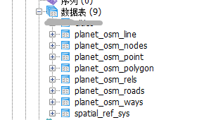
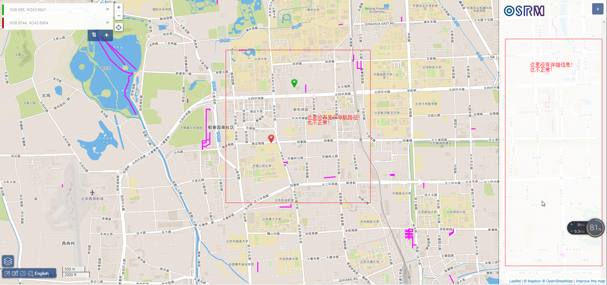
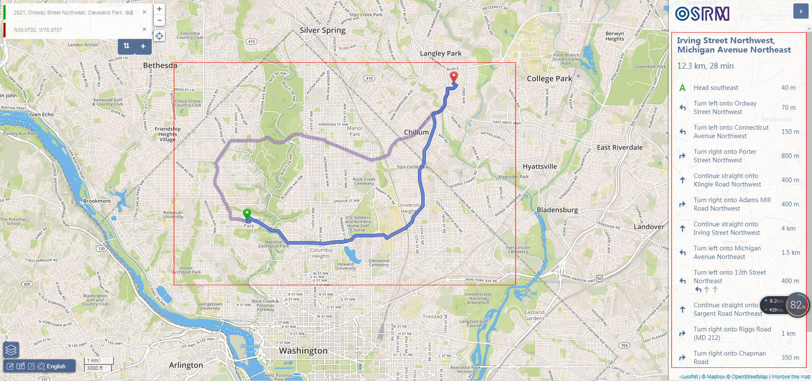
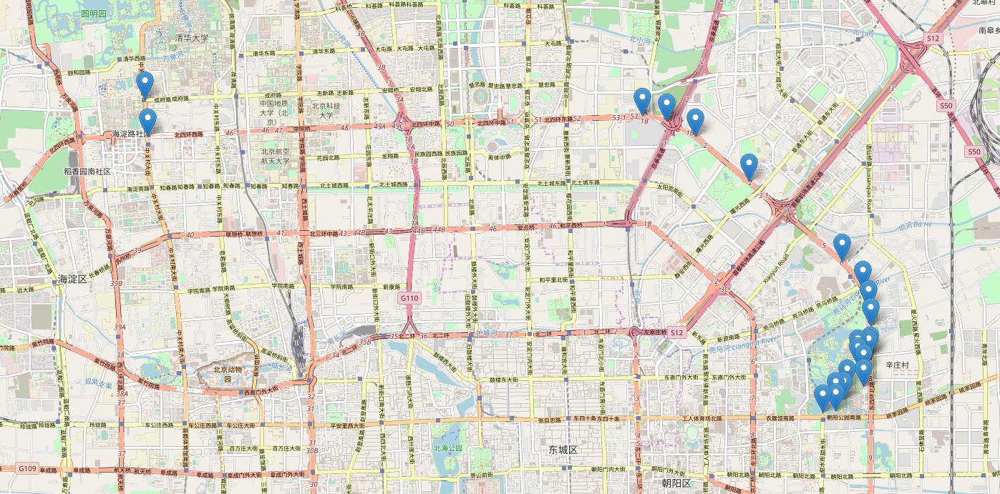
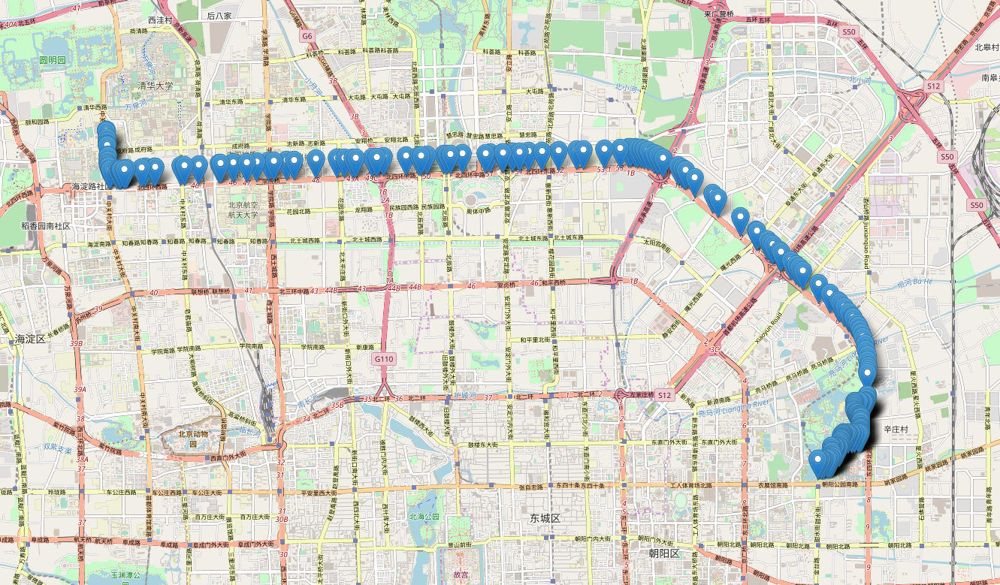

# OSM，OSRM介绍与使用
<!-- TOC -->

- [1. 什么是OSM?](#1-什么是osm)
- [2. 获取地图数据](#2-获取地图数据)
- [3. osm数据导入](#3-osm数据导入)
    - [3.1. centos 7: osm2pgsql安装](#31-centos-7-osm2pgsql安装)
    - [3.2. ubuntu: osm2pgsql安装](#32-ubuntu-osm2pgsql安装)
    - [3.3. 导入地图数据](#33-导入地图数据)
        - [3.3.1. 三张临时表](#331-三张临时表)
        - [3.3.2. 四个数据表](#332-四个数据表)
- [4. 基于OSM的开源导航服务](#4-基于osm的开源导航服务)
    - [4.1. OSRM安装](#41-osrm安装)
    - [4.2. 导航API重要参数记录](#42-导航api重要参数记录)
- [5. 参考资料](#5-参考资料)

<!-- /TOC -->
## 1. 什么是OSM?
开放街道地图（OpenStreetMap，简称OSM）是一个网上地图协作计划，目标是创造一个内容自由且能让所有人编辑的世界地图[wiki：http://wiki.openstreetmap.org/wiki/Main_Page].尤其值得称道的是，osm数据开源，可以自由下载使用。

## 2. 获取地图数据
获取地图数据主要分两种情况，获取大范围数据还是小范围数据。

**小范围数据的获取**比较简单，基本`进入官网->点击导出->手动选择不同的区域->在地图选定导出范围->点击导出`就出来了。其实就是做了一个url请求，也可以根据在url中直接填写经纬度。



**大范围数据的获取** 有多种方式，主要参考上图中的篮框中的内容，这里不多记录，如果在地图中框选范围太大，导出失败，可以直接点击Overpass API的连接，就能够导出数据来了，数据格式可以定义为xml文件。另外，知乎上有个介绍写的很好，参考[获取OpenStreetMap（OSM）数据方法知多少？](https://zhuanlan.zhihu.com/p/25889246)，主要参考其中的第一种方法。

## 3. osm数据导入
### 3.1. centos 7: osm2pgsql安装
这个简直太神奇了，参照博客：[centos 7 osm2pgsql安装](http://www.cnblogs.com/think8848/p/6011073.html)。基本内容/过程没有问题，只是我安装过程中出现了这么几个问题。
- boost-devel版本太低
- gcc版本太低
- gcc多个版本存在选择最低的版本
- `make install`成功后运行`osm2pgsql -version`出现GLIBCXX问题

**解决办法**  
1. 升级boost-devel： 
```sh
# 主要是由于更新源的问题，有些源跟踪不到
# 大部分网址的推荐方法

# 我这里可以用的方法
sudo wget https://bintray.com/vicendominguez/CentOS6/rpm -O etc/yum.repos.d/bintray-vicendominguez-CentOS6.repo
sudo yum install boost-devel
```

2. gcc升级版本（4.4.7 -> 4.8.1）
centos 7最烦我的就是安装什么东西都需要源码安装，好烦的说。安装过程如下：
```sh
# 获取源码
wget http://ftp.gnu.org/gnu/gcc/gcc-4.8.1/gcc-4.8.1.tar.gz
tar -xvzf gcc-4.8.1.tar.gz -C /opt/gcc

# 下载prerequisites时，如果连接不上服务地址
# 就去看一下这个文件的内容（下载，解压，建立连接，删除）
# 用别的方式下载一下。然后更改这个文件的内容。
cd /opt/gcc/gcc-4.8.1 
./contrib/download_prerequisites  

cd ..  
mkdir build_gcc_4.8.1 
cd build_gcc_4.8.1  
../gcc-4.8.1/configure --enable-checking=release --enable-languages=c,c++ --disable-multilib    

# 编译时间很长
make -j4  
make install  

# 升级版本
/usr/sbin/update-alternatives --install  /usr/bin/gcc gcc /usr/local/bin/x86_64-unknown-linux-gnu-gcc-4.8.1 40    
/usr/sbin/update-alternatives --install /usr/bin/g++ g++ /usr/local/bin/g++ 40  
```
3. 改掉旧版本的链接文件
```sh
# 因为系统默认使用低版本的gcc，如果同时存在多个版本也会出问题，所以进行下面操作。
mv /usr/bin/gcc /usr/bin/gcc4.4.7
ln -s /usr/local/bin/gcc /usr/bin/gcc
mv /usr/bin/g++ /usr/bin/g++4.4.7
ln -s /usr/local/bin/g++ /usr/bin/g++
mv /usr/bin/cc /usr/bin/cc4.4.7
ln -s /usr/local/bin/cc /usr/bin/cc
mv /usr/bin/c++ /usr/bin/c++4.4.7
ln -s /usr/local/bin/c++ /usr/bin/c++
```

4. 对文件进行补充
```
strings /usr/lib64/libstdc++.so.6|grep GLIBCXX
```
            GLIBCXX_3.4
            GLIBCXX_3.4.1
            GLIBCXX_3.4.2
            GLIBCXX_3.4.3
            GLIBCXX_3.4.4
            GLIBCXX_3.4.5
            GLIBCXX_3.4.6  
            GLIBCXX_3.4.7
            GLIBCXX_3.4.8
            GLIBCXX_3.4.9
            GLIBCXX_3.4.10
            GLIBCXX_3.4.11
            GLIBCXX_3.4.12
            GLIBCXX_3.4.13
            GLIBCXX_FORCE_NEW
            GLIBCXX_DEBUG_MESSAGE_LENGTH

```sh
# 到编译时的目录下面找到文件：libstdc++.so.6.0.18
# 我编译的时候，建立build_gcc_4.8.1文件夹，具体方法参见：centos升级gcc到4.8.1
# 注意，进入目录是，.libs是隐藏的：
# /home/build_gcc_4.8.1/x86_64-unknown-linux-gnu/libstdc++-v3/src/.libs
# 用下面的命令查看：
strings libstdc++.so.6.0.18|grep GLIBCXX

# 一般来讲，里面就有满足需要的GLIBCXX版本了。
# 然后，把该文件拷贝到了/usr/lib64下.
# 然后将libstdc++.so.6指向libstdc++.so.6.0.18:
rm -r libstdc++.so.6
ln -s libstdc++.so.6.0.18 libstdc++.so.6
```
参考资料：
- [How_to_solve_GLIBCXX_3.4.19](https://github.com/qiwsir/ITArticles/blob/master/Linux/How_to_solve_GLIBCXX_3.4.19.md)
- [CentOS gcc升级4.8步骤](https://blog.csdn.net/clirus/article/details/62424517)
- [CentOS7部署osm2pgsql](https://www.bbsmax.com/A/GBJrlMBd0e/)

### 3.2. ubuntu: osm2pgsql安装
```sh
# ubuntu版本安装就很简单了，一条命令
apt-get intall osm2pgsql
```
### 3.3. 导入地图数据
地图数据导入pg数据库，使用osm2pgsql导入，命令类似于
```shell
# 如果出现ident authentication for user postgres问题的话，su - postgres切换用户
# 但是需要注意postgres读取文件权限问题，把owner和group都改成postgres就好了。
osm2pgsql -s -U postgres -d osm /tmp/map.xml -H 192.168.6.133 -W
```
**注**：osm2pgsql导入数据有两种模式， normal and slim mode。
- normal mode会在内存中产生如下三张中间表，并在导入结束后丢弃，因此速度较快。  
planet_osm_nodes  
planet_osm_ways  
planet_osm_rels

- 而slim mode则将中间结果完全放置到数据库中。slim模式的好处是方便更新。

两者使用的区别在于是否加“-s”，加了表示slim mode，本文使用slim mode。
使用slim mode导入数据后在数据库中会产生如下表。



#### 3.3.1. 三张临时表
`planet_osm_nodes, planet_osm_ways, planet_osm_rels`

需要注意的是nodes表中的lat和lon是bigint类型的数据（可以简单理解为去掉小数点的经纬度值）。从bigint类型转换到经纬度编码的过程，在进行osm2pgsql的时候其实已经做了，只不过数据改存到了point表里面的way值中，这是一种geometry数据类型，更方便使用。这也是这张临时表没什么用的原因。

#### 3.3.2. 四个数据表  
主要是roads是line的子集，有些道路只在line里面，每个表的具体解释可见以下网址：http://wiki.openstreetmap.org/wiki/Osm2pgsql/schema

- planet_osm_line: contains all imported ways
- planet_osm_point: is a subset of the node table, contains all imported nodes with tags，[planet_osm_point 和 planet_osm_nodes的区别](https://gis.stackexchange.com/questions/133149/planet-osm-point-versus-planet-osm-nodes-for-querying-places)。将原始geometry数据展示成4326（也就是wgs84标准）格式的经纬度的代码类似于：
```sql
select ST_AsText(ST_Transform(way, 4326)) from planet_osm_point where osm_id = 1422005356;
/* output */
/* POINT(116.2993276 39.9849500002653) */
```
- planet_osm_polygon: contains all imported polygons. Relations seem to be resolved for that.
- planet_osm_roads: contains a subset of planet_osm_line suitable for rendering at low zoom levels. planet_osm_line contains too many elements to render on overview maps.  


## 4. 基于OSM的开源导航服务
基于OSM的开源导航服务有OSRM和GraphHopper。这里重点记录OSRM，项目放在了github上，叫做[Open Source Routing Machine](https://github.com/Project-OSRM/osrm-backend)。

官网地址：http://project-osrm.org/  
API文档说明地址：http://project-osrm.org/docs/v5.10.0/api/#general-options
### 4.1. OSRM安装
参见github项目的[**README**](https://github.com/Project-OSRM/osrm-backend)和[OSRM笔记](https://my.oschina.net/u/1266171/blog/918232)（博客），都写的很详细，后者基本是前者的翻译。

涉及的主要过程记录在下：
```sh
# install docker
# daocloud.io 国内镜像
curl -sSL https://get.daocloud.io/docker | sh
# Download OpenStreetMap extracts for example from Geofabrik
wget http://download.geofabrik.de/europe/germany/berlin-latest.osm.pbf
# Pre-process the extract with the car profile and start a routing engine HTTP server on port 5000
docker run -t -v $(pwd):/data osrm/osrm-backend osrm-extract -p /opt/car.lua /data/berlin-latest.osm.pbf
docker run -t -v $(pwd):/data osrm/osrm-backend osrm-partition /data/berlin-latest.osrm
docker run -t -v $(pwd):/data osrm/osrm-backend osrm-customize /data/berlin-latest.osrm

docker run -t -i -p 5000:5000 -v $(pwd):/data osrm/osrm-backend osrm-routed --algorithm mld /data/berlin-latest.osrm
# Make requests against the HTTP server
curl "http://127.0.0.1:5000/route/v1/driving/13.388860,52.517037;13.385983,52.496891?steps=true"
# Optionally start a user-friendly frontend on port 9966, and open it up in your browser
docker run -p 9966:9966 osrm/osrm-frontend
xdg-open 'http://127.0.0.1:9966'
```
- 几点说明
1. **customize过程**比较费时，也比较占用计算资源。在10.1.1.58上运行china-latest时，这一步可以把32个cpu都用上，并且至少花费10分钟才能算完。
2. **遗留的问题**：9966端口的页面可以展示，但是无法真正使用。

    不正常工作

    

    正常工作

    

### 4.2. 导航API重要参数记录
[API文档](http://project-osrm.org/docs/v5.10.0/api/#general-options)中的说明很详细，仔细读一遍就知道各个字段是什么意思了。
```
格式：因为是导航功能，这里的coordinates就是指定的行走经过顺序
/route/v1/{profile}/{coordinates}?alternatives={true|false|number}&steps={true|false}&geometries={polyline|polyline6|geojson}&overview={full|simplified|false}&annotations={true|false}
```
| Option	| Values	|Description|
|:---|:--|:--|
|alternatives|	true ,  false (default), or Number	|Search for alternative routes. Passing a number  alternatives=n searches for up to  n alternative routes. *|
|steps|	true ,  false (default)	|Returned route steps for each route leg。会显示具体的步骤信息，比如在当前十字路口右转|
|annotations|	true ,  false (default),  nodes ,  distance , duration ,  datasources ,  weight ,  speed	|Returns additional metadata for each coordinate along the route geometry. 一般只选择true还是false，true的话其中包含很多信息，其中nodes记录了osm地图格式数据中的路段id|
|geometries	|polyline (default),  polyline6 ,  geojson	|Returned route geometry format (influences overview and per step) 表示以什么样的形式返回表示geometries数据，polyline和polyline6都是postgis中表示的集合类型（看起来形似乱码），geojson表示的是json格式的数据，其中coordinates字段记录了经纬度|
|overview	|simplified (default),  full ,  false	|Add overview geometry either full, simplified according to highest zoom level it could be display on, or not at all. 可以简单理解为对geometry的描述，描述的仔细还是不仔细，其实就是描述这段路程使用的轨迹点的数量的多少，比如simplified长这样：<br><br>而full长这样：<br>|
|continue_straight|	default (default),  true ,  false	|Forces the route to keep going straight at waypoints constraining uturns there even if it would be faster. Default value depends on the profile.|
- RouteLeg对象中的annotations属性

    distance和duration单位分别为米和秒，speed单位米/秒，由distance/duration计算得到。nodes就是osm_node表中的id（也是osm_line表中的osm_id）
```json
{
  "distance": 30.0,
  "duration": 100.0,
  "weight": 100.0,
  "steps": [],
  "annotation": {
    "distance": [5,5,10,5,5],
    "duration": [15,15,40,15,15],
    "datasources": [1,0,0,0,1],
    "nodes": [49772551,49772552,49786799,49786800,49786801,49786802],
    "speed": [0.3, 0.3, 0.3, 0.3, 0.3]
  }
}
```
       
## 5. 参考资料
1. [OSM入门+搭建地图服务](http://www.cnblogs.com/LBSer/p/4451471.html), 讲的很详细，值得参考一看
2. [How do I convert the coordinate data from osm into actual longitude latitude points](https://gis.stackexchange.com/questions/163173/how-do-i-convert-the-coordinate-data-from-osm-into-actual-longitude-latitude-poi)
3. [What format is lat/long stored in OSM PostGIS?](https://gis.stackexchange.com/questions/57003/what-format-is-lat-long-stored-in-osm-postgis)
4. [OpenStreetMap、googleMap等经纬度和行列号之间相互转化](http://www.cnblogs.com/Micang/p/6346446.html)