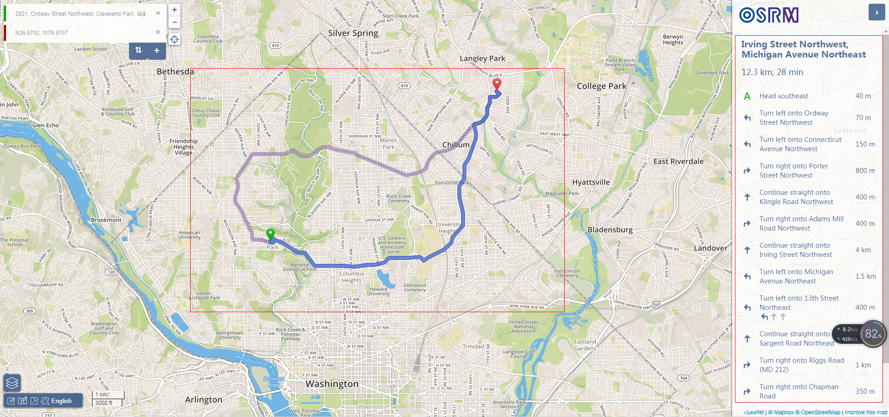

-------------------------------
    OSM 学习笔记
    @author： 陈凯恒
    @createtime： 2017-12-29
-------------------------------

# OSM 学习笔记
<!-- TOC -->

- [什么是OSM?](#什么是osm)
- [如何使用OSM?](#如何使用osm)
    - [获取地图数据](#获取地图数据)
    - [地图数据解释](#地图数据解释)
        - [三张临时表：planet_osm_nodes, planet_osm_ways, planet_osm_rels](#三张临时表planet_osm_nodes-planet_osm_ways-planet_osm_rels)
        - [planet_osm_point](#planet_osm_point)
- [基于OSM的开源导航服务](#基于osm的开源导航服务)
    - [OSRM安装](#osrm安装)
    - [导航API重要参数记录](#导航api重要参数记录)
- [参考资料](#参考资料)

<!-- /TOC -->
## 什么是OSM?
开放街道地图（OpenStreetMap，简称OSM）是一个网上地图协作计划，目标是创造一个内容自由且能让所有人编辑的世界地图[wiki：http://wiki.openstreetmap.org/wiki/Main_Page].尤其值得称道的是，osm数据开源，可以自由下载使用。

## 如何使用OSM?
### 获取地图数据
获取地图数据主要分两种情况，获取大范围数据还是小范围数据。

**小范围数据的获取**比较简单，基本`进入官网->点击导出->手动选择不同的区域->在地图选定导出范围->点击导出`就出来了。其实就是做了一个url请求，也可以根据在url中直接填写经纬度。


**大范围数据的获取** 有多种方式，主要参考上图中的篮框中的内容，这里不多记录，如果在地图中框选范围太大，导出失败，可以直接点击Overpass API的连接，就能够导出数据来了，数据格式可以定义为xml文件。另外，知乎上有个介绍写的很好，参考[获取OpenStreetMap（OSM）数据方法知多少？](https://zhuanlan.zhihu.com/p/25889246)，主要参考其中的第一种方法。

### 地图数据解释
地图数据导入pg数据库，使用osm2pgsql（apt-get intall osm2pgsql）导入，命令类似于
```shell
osm2pgsql -s -U postgres -d osm /tmp/map.xml -H 192.168.6.133 -W。
```

命令行参数详解见[command-line usage](https://github.com/openstreetmap/osm2pgsql/blob/master/docs/usage.md)

**注**：osm2pgsql导入数据有两种模式， normal and slim mode。
- normal mode会在内存中产生如下三张中间表，并在导入结束后丢弃，因此速度较快。  
planet_osm_nodes  
planet_osm_ways  
planet_osm_rels

- 而slim mode则将中间结果完全放置到数据库中。slim模式的好处是方便更新。

两者使用的区别在于是否加“-s”，加了表示slim mode，本文使用slim mode。
使用slim mode导入数据后在数据库中会产生如下表。


#### 三张临时表：planet_osm_nodes, planet_osm_ways, planet_osm_rels
需要注意的是nodes表中的lat和lon是bigint类型的数据，它们并不是经纬度的多少倍或是什么样子，而是一种表示方式（你可以认为是一种编码方式）。从bigint类型转换到经纬度编码的过程，在进行osm2pgsql的时候其实已经做了，只不过数据改存到了point表里面的way值中，这是一种geometry数据类型，更方便使用。这也是这张临时表没什么用的原因。

#### planet_osm_point
将原始geometry数据展示成4326（也就是wgs84标准）格式的经纬度的代码类似于：
```sql
select ST_AsText(ST_Transform(way, 4326)) from planet_osm_point where osm_id = 1422005356
```

## 基于OSM的开源导航服务
基于OSM的开源导航服务有OSRM和GraphHopper。这里重点记录OSRM，项目放在了github上，叫做[Open Source Routing Machine](https://github.com/Project-OSRM/osrm-backend)。

官网地址：http://project-osrm.org/  
API文档说明地址：http://project-osrm.org/docs/v5.10.0/api/#general-options
### OSRM安装
参见github项目的[**README**](https://github.com/Project-OSRM/osrm-backend)和[OSRM笔记](https://my.oschina.net/u/1266171/blog/918232)（博客），都写的很详细，后者基本是前者的翻译。

涉及的主要过程记录在下：
```sh
# install docker
# daocloud.io 国内镜像
curl -sSL https://get.daocloud.io/docker | sh
# Download OpenStreetMap extracts for example from Geofabrik
wget http://download.geofabrik.de/europe/germany/berlin-latest.osm.pbf
# Pre-process the extract with the car profile and start a routing engine HTTP server on port 5000
docker run -t -v $(pwd):/data osrm/osrm-backend osrm-extract -p /opt/car.lua /data/berlin-latest.osm.pbf
docker run -t -v $(pwd):/data osrm/osrm-backend osrm-partition /data/berlin-latest.osrm
docker run -t -v $(pwd):/data osrm/osrm-backend osrm-customize /data/berlin-latest.osrm

docker run -t -i -p 5000:5000 -v $(pwd):/data osrm/osrm-backend osrm-routed --algorithm mld /data/berlin-latest.osrm
# Make requests against the HTTP server
curl "http://127.0.0.1:5000/route/v1/driving/13.388860,52.517037;13.385983,52.496891?steps=true"
# Optionally start a user-friendly frontend on port 9966, and open it up in your browser
docker run -p 9966:9966 osrm/osrm-frontend
xdg-open 'http://127.0.0.1:9966'
```
- 几点说明
1. **customize过程**比较费时，也比较占用计算资源。在10.1.1.58上运行china-latest时，这一步可以把32个cpu都用上，并且至少花费10分钟才能算完。
2. **遗留的问题**：9966端口的页面可以展示，但是无法真正使用。

    不正常工作

    

    正常工作

    

### 导航API重要参数记录
[API文档](http://project-osrm.org/docs/v5.10.0/api/#general-options)中的说明很详细，仔细读一遍就知道各个字段是什么意思了。

- RouteLeg对象中的annotations属性

    distance和duration单位分别为米和秒，speed单位米/秒，由distance/duration计算得到。nodes就是osm_node表中的id（也是osm_line表中的osm_id）
```json
{
  "distance": 30.0,
  "duration": 100.0,
  "weight": 100.0,
  "steps": [],
  "annotation": {
    "distance": [5,5,10,5,5],
    "duration": [15,15,40,15,15],
    "datasources": [1,0,0,0,1],
    "nodes": [49772551,49772552,49786799,49786800,49786801,49786802],
    "speed": [0.3, 0.3, 0.3, 0.3, 0.3]
  }
}
```
       
## 参考资料
1. [OSM入门+搭建地图服务](http://www.cnblogs.com/LBSer/p/4451471.html), 讲的很详细，值得参考一看
2. [How do I convert the coordinate data from osm into actual longitude latitude points](https://gis.stackexchange.com/questions/163173/how-do-i-convert-the-coordinate-data-from-osm-into-actual-longitude-latitude-poi)
3. [What format is lat/long stored in OSM PostGIS?](https://gis.stackexchange.com/questions/57003/what-format-is-lat-long-stored-in-osm-postgis)
4. [OpenStreetMap、googleMap等经纬度和行列号之间相互转化](http://www.cnblogs.com/Micang/p/6346446.html)