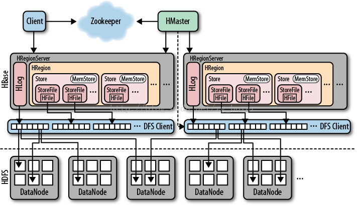

# HBase面试整理
<!-- TOC -->

- [1. 总结性介绍](#1-总结性介绍)
- [2. 存储结构](#2-存储结构)

<!-- /TOC -->
参考资料：
- [列式存储hbase系统架构学习](http://www.ixirong.com/2015/07/16/learn-about-hbase/)
- [Hbase原理、基本概念、基本架构](https://blog.csdn.net/woshiwanxin102213/article/details/17584043)
- [HBase笔记：存储结构](http://blog.javachen.com/2013/06/15/hbase-note-about-data-structure.html)

## 1. 总结性介绍
- HBase是一个构建在HDFS上的分布式列存储系统，是基于Google BigTable模型开发的，典型的key/value系统。
- 与传统mysql、Oracle数据库的主要区别就是列式存储和行式存储的区别。
- Hbase适合大量插入同时又有读的情况。输入一个Key获取一个value或输入一些key获得一些value。
- Hbase目标主要依靠横向扩展，通过不断增加廉价的商用服务器，来增加计算和存储能力。
- Hbase表的特点
    - 大：一个表可以有数十亿行，上百万列；
    - 无模式：每行都有一个可排序的主键和任意多的列，列可以根据需要动态的增加，同一张表中不同的行可以有截然不同的列；
    - 面向列：面向列（族）的存储和权限控制，列（族）独立检索；
    - 稀疏：空（null）列并不占用存储空间，表可以设计的非常稀疏；
    - 数据多版本：每个单元中的数据可以有多个版本，默认情况下版本号自动分配，是单元格插入时的时间戳；
    - 数据类型单一：Hbase中的数据都是字符串，没有类型。

## 2. 存储结构

Zookeeper：
- 保证任何时候，集群中只有一个master
- 存贮所有Region的寻址入口。
- 实时监控Region Server的状态，将Region server的上线和下线信息实时通知给Master
- 存储Hbase的schema,包括有哪些table，每个table有哪些column family

HMaster: 
- 为Region server分配region，负责region server的负载均衡
- 管理用户对Table的增、删、改、查操作
- 发现失效的region server并重新分配其上的region
- GFS上的垃圾文件回收
- 在HRegionServer停机后，负责失效HRegionServer 上的Regions迁移
> client访问Hbase上数据的过程并不需要master参与(寻址访问zookeeper和region server，数据读写访问regione server)，master仅仅维护着**table**和**region**的元数据信息，负载很低。

HRegion Server
- Region server维护Master分配给它的region，处理对这些region的IO请求
- Region server负责切分在运行过程中变得过大的region
