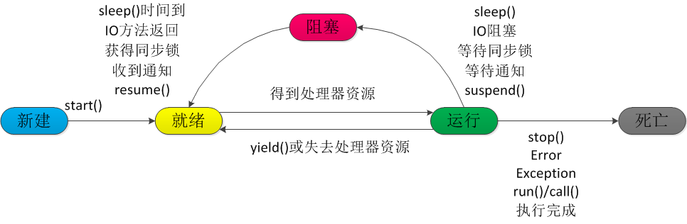

# Java多线程总结
<!-- TOC -->

- [Java多线程总结](#java多线程总结)
    - [1. 线程与进程的区别](#1-线程与进程的区别)
    - [2. 等待线程结束的方法有哪些？](#2-等待线程结束的方法有哪些)
    - [3. Java线程的生命周期](#3-java线程的生命周期)
    - [4. Thread和Runnable的区别与联系](#4-thread和runnable的区别与联系)
    - [5. 线程池: ThreadPool](#5-线程池-threadpool)
    - [final关键字与线程安全](#final关键字与线程安全)

<!-- /TOC -->
## 1. 线程与进程的区别

## 2. 等待线程结束的方法有哪些？
等待线程结束的方法，当然可以通过在`run()`函数里面更改标示位（或者变量），然后检测这个标示位（变量）来判断线程是否已经完成任务。但是，但是，以上都是多余的（而且是非常复杂，不实用的设计）。JDK本身就已经提供了判断线程结束的方法。参考文章：[Java主线程等待子线程、线程池](http://blog.csdn.net/xiao__gui/article/details/9213413)

- 最基本的方法：调用`thread.join()`
- 在主线程中使用`while(Thread.activeCount() > 1){ Thread.yield(); }`，意识是在子线程没结束的时候主线程一直做让步操作直到所有子线程都完成后，继续运行。
- 不太基本的方法：设置`CountDownLatch`成员，run方法内调用`countDownLatch.countDown();`主线程调用`countDownLatch.await();`
- 等待线程池所有线程执行完成的方法：`boolean awaitTermination(long timeout, TimeUnit unit)`

***代码1：join()方法调用***
```java
public class JoinTest {
    public static void main(String[] args) throws InterruptedException {
        Thread thread = new Thread(){
            public void run(){
                int i = 0;
                while(i < 10){
                    try {
                        Thread.sleep(1000);
                    } catch (InterruptedException e) {
                        e.printStackTrace();
                    }
                    System.out.println(Thread.currentThread() + ": I am sleeping");
                    i++;
                }
            }
        };
        thread.start();
        thread.join();
        System.out.println("main done");		
	}
}
```
***代码2：线程池等待所有线程执行完成***
```java
public class TestThread extends Thread{  
    public void run(){  
        System.out.println(this.getName() + "子线程开始");  
        try{  
            // 子线程休眠五秒  
            Thread.sleep(5000);  
        }  
        catch (InterruptedException e)  {  
            e.printStackTrace();  
        }  
        System.out.println(this.getName() + "子线程结束");  
    }  
}  

public class Main{  
    public static void main(String[] args){  
        long start = System.currentTimeMillis();  
          
        // 创建一个同时允许两个线程并发执行的线程池  
        ExecutorService executor = Executors.newFixedThreadPool(2);  
        for(int i = 0; i < 5; i++){  
            Thread thread = new TestThread();  
            executor.execute(thread);  
        }  
        executor.shutdown();  
          
        try{  
            // awaitTermination返回false即超时会继续循环，返回true即线程池中的线程执行完成主线程跳出循环往下执行，每隔10秒循环一次  
            while (!executor.awaitTermination(10, TimeUnit.SECONDS));  
        }  
        catch (InterruptedException e){  
            e.printStackTrace();  
        }  
          
        long end = System.currentTimeMillis();  
        System.out.println("子线程执行时长：" + (end - start));
    }
}
```
***代码3：在main中使用yield，进程让步，使线程从运行态变为就绪态***
```java

public class Main{  
    public static void main(String[] args){  
        long start = System.currentTimeMillis();  
          
        // 创建一个同时允许两个线程并发执行的线程池  
        ExecutorService executor = Executors.newFixedThreadPool(2);  
        for(int i = 0; i < 5; i++){  
            executor.execute(new Thread(()->{doSomething()}));  
        }  
        executor.shutdown();  
          
        while (Thread.activeCount() > 1) {
			Thread.yield();
		}

        long end = System.currentTimeMillis();  
        System.out.println("子线程执行时长：" + (end - start));
    }
}
```
## 3. Java线程的生命周期
参考：[线程的生命周期](https://www.cnblogs.com/sunddenly/p/4106562.html)
- 新建(New)、就绪（Runnable）、运行（Running）、阻塞(Blocked)和死亡(Dead)5种状态

1. 新建状态，当程序使用new关键字创建了一个线程之后，该线程就处于新建状态，此时仅由JVM为其分配内存，并初始化其成员变量的值
2. 就绪状态，当线程对象调用了`start()`方法之后，该线程处于就绪状态。**Java虚拟机会为其创建方法调用栈和程序计数器，等待调度运行**
3. 运行状态，如果处于就绪状态的线程获得了CPU，开始执行`run()`方法的线程执行体，则该线程处于运行状态
4. 阻塞状态，当处于运行状态的线程失去所占用资源之后，便进入阻塞状态
5. 在线程的生命周期当中，线程的各种状态的转换过程



## 4. Thread和Runnable的区别与联系

## 5. 线程池: ThreadPool

## final关键字与线程安全
参考资料：
- [java多线程学习(九)final的内存语义](https://blog.csdn.net/Ditto_zhou/article/details/78738197)
- [Thread-safety with the Java final keyword](https://www.javamex.com/tutorials/synchronization_final.shtml), [中文翻译版](https://www.cnblogs.com/mianlaoshu/articles/3648403.html)

- final关键字在多线程使用中主要用在对属性的修饰上，这样可以保证该属性在多个线程中读线程安全。这种效果的作用机理与java内存模型有关，这里保证了类中的属性在构造函数结束前不可见（内存屏障），JMM禁止指针赋值操作在构造函数结束后运行。在多线程环境下，应该尽量多的使用final关键字。

- java的concurrentHashMap就大量使用了final关键字