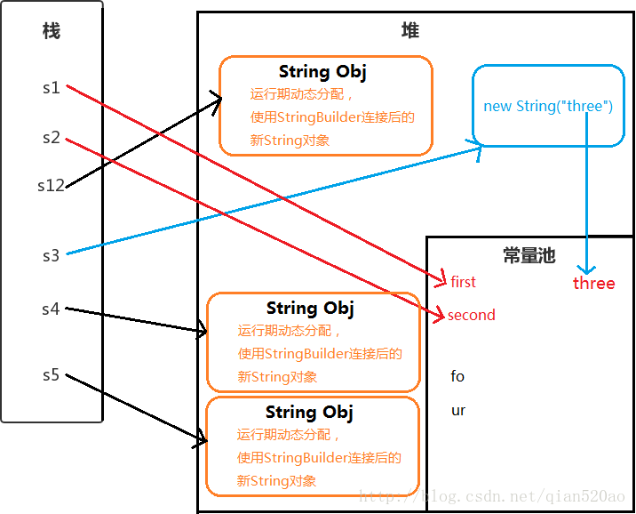

# Java中关于String的总结
参考资料：
- [深入解析String#intern](https://tech.meituan.com/in_depth_understanding_string_intern.html)
- [JDK6和JDK7中的substring()方法](http://www.importnew.com/7418.html)
- [深入理解Java Class文件格式（系列一到九）](https://blog.csdn.net/zhangjg_blog/article/details/21486985)
- [实例分析JAVA CLASS的文件结构](https://coolshell.cn/articles/9229.html)
- [java StringUtils方法全览](https://blog.csdn.net/songylwq/article/details/7028010)

## Java面试的几个小问题
1. 如何比较两个字符串？使用“==”还是equals()方法？  
比较字符串指针是否相等用==，只判断值的话就是equals()

2. `String a = new String("Hello World")`创建了几个对象？  
2个。看下面调用构造方法的源码，注意到传入的参数也是一个String对象，因此`new String("Hello World")`创建的第一个对象是构造器里的参数对象相当于`String original="Hello World"`，第二个对象是`new`的返回值。  
```java
public String(String original) {
    this.value = original.value;
    this.hash = original.hash;
}
```

3. 为什么针对安全保密高的信息，char[]比String更好?  
因为String是不可变的，就是说它一旦创建，就不能更改了，直到垃圾收集器将它回收走。而字符数组中的元素是可以更改的（译者注：这就意味着你就可以在使用完之后将其更改，而不会保留原始的数据）。所以使用字符数组的话，安全保密性高的信息(如密码之类的)将不会存在于系统中被他人看到。
4. 我们可以针对字符串使用switch条件语句吗？  
从JDK 7开始, 可以针对字符串使用switch条件语句了；在JDK 6或者之前的版本，不能使用switch条件语句。

5. String是否是线程安全的？  
因为String是final类型的，所以一定是线程安全的。
6. String为什么是不可变的，final的类有什么好处？  
首先是线程安全，第二是节约空间提高访问效率。

## Java中不同的String创建方式
```java
public void showInPng(){    
    // 使用 " " 双引号创建
    String s1 = "first";
    // 使用字符串连接符拼接
    String s2 = "se"+"cond";
    // 使用字符串加引用拼接
    String s12 = "first" + s2; // 注意这个是运行期间动态分配的
    // 使用new String("")创建
    String s3 = new String("three");
    // 使用new String("")拼接
    String s4 = new String("fo") + "ur";
    // 使用new String("")拼接
    String s5 = new String("fo") + new String("ur");
}
```


## String, StringBuilder, StringBuffer之间的差别与使用习惯
String vs StringBuilder: StringBuilder是可变的，这意味着它创建之后仍旧可以更改它的值。

StringBuilder vs StringBuffer: StringBuffer是synchronized的,它是线程安全的的，但是比StringBuilder要慢。

## `String.intern()`方法分析
`intern()`方法描述起来很简单：如果常量池中存在当前字符串, 就会直接返回当前字符串. 如果常量池中没有此字符串, 会将此字符串放入常量池中后, 再返回。有趣的是在jdk的发展过程中，jvm的变化可能导致一些不太一样的结果。就大多数时候而言，并不影响使用。详情参见[深入解析String#intern](https://tech.meituan.com/in_depth_understanding_string_intern.html)
```java
package act.chenkh.study.test.bean;

public class StringAck {
	public static void main(String[] args) {
		StringAck ack = new StringAck();
		ack.testIntern();
	}

	public void testIntern() {
		String s = new String("1");
		String s2 = "1";
		s.intern();
		System.out.println(s == s2);
		System.out.println(s.intern() == s2);

		String s3 = new String("1") + new String("1");
		// s3进行intern操作后将"11"这个字符串放进了常量池中，
		// 但是常量池也在heap里面(from jdk7)，常量池直接引用heap中的引用。
		// 所以相当于把s3指向的地址变成了常量池中的地址。
		s3.intern();
		// s4创建的时候先看常量池有没有"11"，发现有，所以返回与s3相同的引用。
		String s4 = "11";
		System.out.println(s3 == s4);
		
		String s5 = new String("1") + new String("1");
		String s6 = "11";
		System.out.println(s5 == s6);
	}
}

```
## StringUtils工具
StringUtils位于org.apache.commons.lang包下，引用时需要导入。
```xml
<dependency>
    <groupId>org.apache.commons</groupId>
    <artifactId>commons-lang3</artifactId>
    <version>3.6</version>
</dependency>
```
```java
// 重复一个字符串
String str = "abcd";
String repeated = StringUtils.repeat(str,3); //abcdabcdabcd
// 计算一个字符串某个字符的出现次数
int n = StringUtils.countMatches("11112222", "1");
System.out.println(n);
```