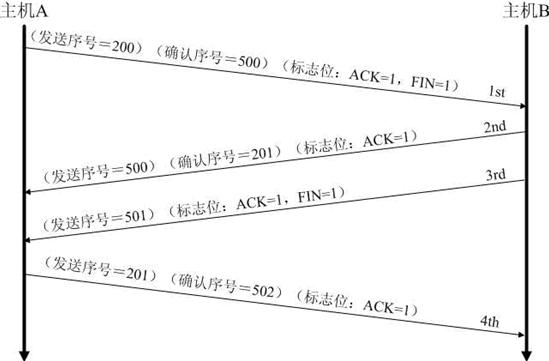

# tcp三次握手与四次挥手
## 详细过程及状态变化

在TCP层，有个FLAGS字段，这个字段有以下几个标识：SYN, FIN, ACK, PSH, RST, URG.
其中，对于我们日常的分析有用的就是前面的五个字段。

它们的含义是：
- SYN表示建立连接，
- FIN表示关闭连接，
- ACK表示响应，
- PSH表示有 DATA数据传输，
- RST表示连接重置。

其中，ACK是可能与SYN，FIN等同时使用的，比如SYN和ACK可能同时为1，它表示的就是建立连接请求之后的响应，如果只是单个的一个SYN，它表示的只是建立连接。TCP的几次握手就是通过这样的ACK表现出来的。但SYN与FIN是不会同时为1的，因为前者表示的是建立连接，而后者表示的是断开连接。RST一般是在FIN之后才会出现为1的情况，表示的是连接重置。一般地，当出现FIN包或RST包时，我们便认为客户端与服务器端断开了连接；而当出现SYN和SYN＋ACK包时，我们认为客户端与服务器建立了一个连接。PSH为1的情况，一般只出现在 DATA内容不为0的包中，也就是说PSH为1表示的是有真正的TCP数据包内容被传递。TCP的连接建立和连接关闭，都是通过请求－响应的模式完成的。

## 为什么需要三次握手和四次挥手