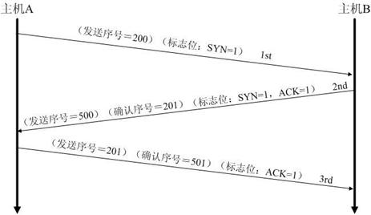

# 面试随笔
记录一些在面试过程中遇到的问题

<!-- TOC -->

- [1. 程序lang掉（无响应）](#1-程序lang掉无响应)
- [3. 网易的两道题](#3-网易的两道题)
    - [3.1. 符合n，k的数对有多少种](#31-符合nk的数对有多少种)
    - [3.2. 有多少种装法](#32-有多少种装法)
- [腾讯面试题](#腾讯面试题)
    - [带符号大数加减](#带符号大数加减)
- [阿里电话面试](#阿里电话面试)
    - [JStorm流程 和 JStorm Slot](#jstorm流程-和-jstorm-slot)
    - [B+树为什么适合数据库，为什么快](#b树为什么适合数据库为什么快)
    - [红黑树的五个特点](#红黑树的五个特点)
    - [java nio](#java-nio)
        - [什么是java.nio?](#什么是javanio)
        - [与io的主要区别](#与io的主要区别)
    - [HBase流程](#hbase流程)
    - [kafka数据压缩](#kafka数据压缩)
    - [java 线程池](#java-线程池)
    - [tcp三次握手和四次挥手详细过程及状态变化](#tcp三次握手和四次挥手详细过程及状态变化)
    - [java读取文件有哪几种方法，区别是什么](#java读取文件有哪几种方法区别是什么)
    - [Java线程的生命周期](#java线程的生命周期)

<!-- /TOC -->

## 1. 程序lang掉（无响应）
## 3. 网易的两道题
### 3.1. 符合n，k的数对有多少种
### 3.2. 有多少种装法

## 腾讯面试题
### 带符号大数加减

## 阿里电话面试
### JStorm流程 和 JStorm Slot
### B+树为什么适合数据库，为什么快
- 为什么B+树索引结构是存储在磁盘上的？
- 为什么比B树更好？
### 红黑树的五个特点
### java nio
参考：
- [Java nio浅析](https://tech.meituan.com/nio.html)
- [NIO 入门](https://www.ibm.com/developerworks/cn/education/java/j-nio/j-nio.html)
- [Java NIO 系列教程](http://ifeve.com/java-nio-all/)
- [Java NIO Tutorials](http://tutorials.jenkov.com/java-nio/index.html)
#### 什么是java.nio?
NIO（Non-blocking I/O，在Java领域，也称为New I/O），是一种同步非阻塞的I/O模型，也是I/O多路复用的基础，已经被越来越多地应用到大型应用服务器，成为解决高并发与大量连接、I/O处理问题的有效方式。

#### 与io的主要区别
| IO   |    NIO|
|:----|:----|
| 面向流 | 面向缓冲 |
| 阻塞IO | 非阻塞IO |
| 无     | 选择器 | 
- 面向流与面向缓冲  
Java NIO和IO之间第一个最大的区别是，IO是面向流的，NIO是面向缓冲区的。 Java IO面向流意味着每次从流中读一个或多个字节，直至读取所有字节，它们没有被缓存在任何地方。此外，它不能前后移动流中的数据。如果需要前后移动从流中读取的数据，需要先将它缓存到一个缓冲区。 Java NIO的缓冲导向方法略有不同。数据读取到一个它稍后处理的缓冲区，需要时可在缓冲区中前后移动。这就增加了处理过程中的灵活性。但是，还需要检查是否该缓冲区中包含所有您需要处理的数据。而且，需确保当更多的数据读入缓冲区时，不要覆盖缓冲区里尚未处理的数据。

- 阻塞与非阻塞IO  
Java IO的各种流是阻塞的。这意味着，当一个线程调用read() 或 write()时，该线程被阻塞，直到有一些数据被读取，或数据完全写入。该线程在此期间不能再干任何事情了。 Java NIO的非阻塞模式，使一个线程从某通道发送请求读取数据，但是它仅能得到目前可用的数据，如果目前没有数据可用时，就什么都不会获取。而不是保持线程阻塞，所以直至数据变的可以读取之前，该线程可以继续做其他的事情。 非阻塞写也是如此。一个线程请求写入一些数据到某通道，但不需要等待它完全写入，这个线程同时可以去做别的事情。 线程通常将非阻塞IO的空闲时间用于在其它通道上执行IO操作，所以一个单独的线程现在可以管理多个输入和输出通道（channel）。

- 选择器（Selectors）  
Java NIO的选择器允许一个单独的线程来监视多个输入通道，你可以注册多个通道使用一个选择器，然后使用一个单独的线程来“选择”通道：这些通道里已经有可以处理的输入，或者选择已准备写入的通道。这种选择机制，使得一个单独的线程很容易来管理多个通道。

### HBase流程

### kafka数据压缩

### java 线程池

### tcp三次握手和四次挥手详细过程及状态变化




在TCP层，有个FLAGS字段，这个字段有以下几个标识：SYN, FIN, ACK, PSH, RST, URG.
其中，对于我们日常的分析有用的就是前面的五个字段。

它们的含义是：
- SYN表示建立连接，
- FIN表示关闭连接，
- ACK表示响应，
- PSH表示有 DATA数据传输，
- RST表示连接重置。

其中，ACK是可能与SYN，FIN等同时使用的，比如SYN和ACK可能同时为1，它表示的就是建立连接请求之后的响应，如果只是单个的一个SYN，它表示的只是建立连接。TCP的几次握手就是通过这样的ACK表现出来的。但SYN与FIN是不会同时为1的，因为前者表示的是建立连接，而后者表示的是断开连接。RST一般是在FIN之后才会出现为1的情况，表示的是连接重置。一般地，当出现FIN包或RST包时，我们便认为客户端与服务器端断开了连接；而当出现SYN和SYN＋ACK包时，我们认为客户端与服务器建立了一个连接。PSH为1的情况，一般只出现在 DATA内容不为0的包中，也就是说PSH为1表示的是有真正的TCP数据包内容被传递。TCP的连接建立和连接关闭，都是通过请求－响应的模式完成的。

### java读取文件有哪几种方法，区别是什么
参考：
- [Java文件读取方式](http://www.cnblogs.com/lovebread/archive/2009/11/23/1609122.html)
- [Java IO流学习总结](https://zhuanlan.zhihu.com/p/28757397)


1. 按字节读取文件内容：常用于读二进制文件，如图片、声音、影像等文件。
2. 按字符读取文件内容：以字符为单位读取文件，常用于读文本，数字等类型的文件
3. 按行读取文件内容：以行为单位读取文件，常用于读面向行的格式化文件
4. 随机读取文件内容 

- 关于一次性读取文件内容：  
一次性读取文件比按行读取效率要高很多，因为每次调用readLine()方法都需要转换编码，而一次性读取只需要转换一次。
```java
public String readToString(String fileName) {  
        String encoding = "ISO-8859-1";  
        File file = new File(fileName);  
        Long filelength = file.length();  
        byte[] filecontent = new byte[filelength.intValue()];  
        try {  
            FileInputStream in = new FileInputStream(file);  
            in.read(filecontent);  
            in.close();  
        } catch (FileNotFoundException e) {  
            e.printStackTrace();  
        } catch (IOException e) {  
            e.printStackTrace();  
        }  
        try {  
            return new String(filecontent, encoding);  
        } catch (UnsupportedEncodingException e) {  
            System.err.println("The OS does not support " + encoding);  
            e.printStackTrace();  
            return null;  
        }  
    }  
}
```
### Java线程的生命周期
参考：[线程的生命周期](https://www.cnblogs.com/sunddenly/p/4106562.html)
- 新建(New)、就绪（Runnable）、运行（Running）、阻塞(Blocked)和死亡(Dead)5种状态

1. 新建状态，当程序使用new关键字创建了一个线程之后，该线程就处于新建状态，此时仅由JVM为其分配内存，并初始化其成员变量的值
2. 就绪状态，当线程对象调用了`start()`方法之后，该线程处于就绪状态。**Java虚拟机会为其创建方法调用栈和程序计数器，等待调度运行**
3. 运行状态，如果处于就绪状态的线程获得了CPU，开始执行`run()`方法的线程执行体，则该线程处于运行状态
4. 阻塞状态，当处于运行状态的线程失去所占用资源之后，便进入阻塞状态
5. 在线程的生命周期当中，线程的各种状态的转换过程

